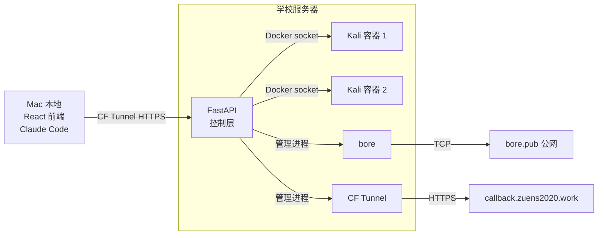
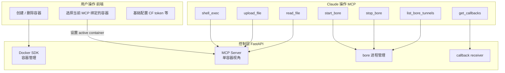
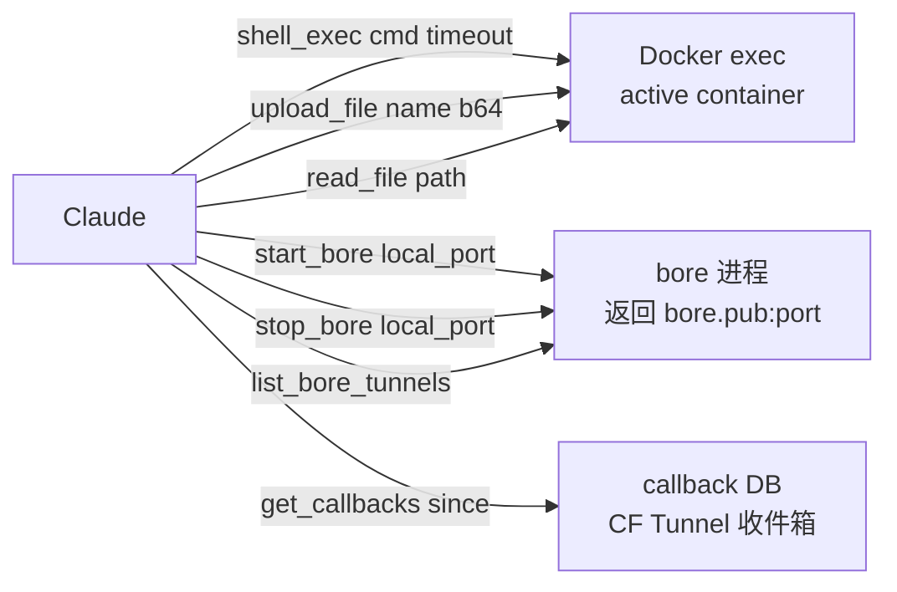
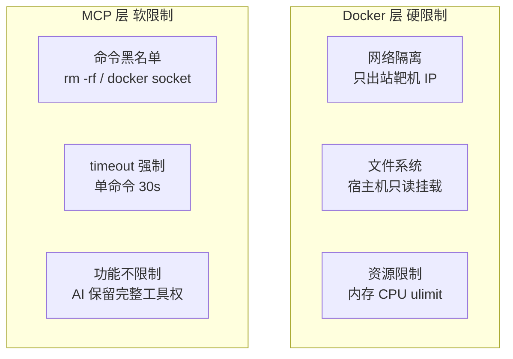

# CTF AutoPwn — 开发计划

## 系统拓扑



---

## 职责边界



---

## MCP Tools



MCP 不感知容器是哪个，由前端设置 active container，控制层透传。

---

## 项目结构

```
ctf-autopwn/
├── backend/
│   ├── app/
│   │   ├── main.py               # FastAPI 入口，挂载所有路由
│   │   ├── config.py             # 环境变量，active container 状态
│   │   ├── mcp/
│   │   │   ├── server.py         # fastmcp 集成，/mcp endpoint
│   │   │   └── tools/
│   │   │       ├── shell.py      # shell_exec / upload_file / read_file
│   │   │       ├── bore.py       # start_bore / stop_bore / list_bore_tunnels
│   │   │       └── callback.py   # get_callbacks
│   │   ├── api/
│   │   │   ├── containers.py     # 容器 CRUD，设置 active container
│   │   │   ├── config.py         # CF token 等配置读写
│   │   │   └── callbacks.py      # callback 收件箱查询
│   │   ├── core/
│   │   │   ├── docker.py         # Docker SDK 封装
│   │   │   ├── bore.py           # bore 进程生命周期管理
│   │   │   └── security.py       # 命令黑名单
│   │   └── db/
│   │       ├── database.py       # SQLite 连接
│   │       └── models.py         # Callback 记录模型
│   ├── Dockerfile.kali           # Kali 镜像，预装工具链
│   ├── docker-compose.yml
│   └── requirements.txt
│
└── frontend/
    ├── src/
    │   ├── pages/
    │   │   ├── Dashboard.tsx     # 容器状态总览
    │   │   ├── Containers.tsx    # 容器管理，选 active
    │   │   ├── Callbacks.tsx     # callback 收件箱
    │   │   └── Settings.tsx      # CF token 等配置
    │   ├── components/
    │   │   ├── ContainerCard.tsx
    │   │   └── ActiveBadge.tsx   # 当前 active 容器标识
    │   └── api/
    │       └── client.ts
    └── vite.config.ts
```

---

## API 设计

### 容器管理（前端用）

| Method | Path | 说明 |
|--------|------|------|
| GET | /api/containers | 容器列表和状态 |
| POST | /api/containers | 创建新容器 |
| DELETE | /api/containers/{name} | 删除容器 |
| PUT | /api/containers/{name}/activate | 设置 active container |
| GET | /api/containers/active | 查询当前 active |

### 配置（前端用）

| Method | Path | 说明 |
|--------|------|------|
| GET | /api/config | 读取配置 |
| PUT | /api/config | 保存配置 |

### Callback（前端 + MCP 共用）

| Method | Path | 说明 |
|--------|------|------|
| GET | /api/callbacks | 查询收到的请求 |
| DELETE | /api/callbacks | 清空 |
| POST | /callback/{token} | 靶机回调入口 |

### MCP

| Transport | Path | 说明 |
|-----------|------|------|
| HTTP Streamable | /mcp | Claude Code 连接点 |

---

## 安全边界



---

## Tech Stack

| 模块 | 选型 | 理由 |
|------|------|------|
| 后端框架 | FastAPI | Sherpa 已在用，async 原生 |
| MCP 集成 | fastmcp | FastAPI 原生集成，HTTP transport |
| Docker 控制 | docker-py | 直连本地 socket |
| 数据库 | SQLite + SQLModel | 本地零运维 |
| 前端 | React + Vite + TypeScript | 轻量，组件生态好 |
| TCP 穿透 | bore | 开源，无需账号，单二进制 |
| HTTP 穿透 | Cloudflare Tunnel | 已有基础设施，HTTPS，稳定 |

---

## 开发计划

### Phase 01 — 基础骨架

- [ ] FastAPI 项目初始化，目录结构
- [ ] Docker SDK 接入：list / create / destroy / exec
- [ ] active container 状态管理（内存，重启丢失）
- [ ] `Dockerfile.kali`：基础工具链（pwntools / gdb / nmap / sqlmap / ghidra-headless 等）
- [ ] docker-compose.yml：服务编排
- [ ] CF Tunnel 配置，验证域名可达

### Phase 02 — MCP Server

- [ ] fastmcp 集成进 FastAPI，`/mcp` endpoint
- [ ] `shell_exec`：docker exec，黑名单过滤，timeout
- [ ] `upload_file`：写入容器 /tmp/workspace/
- [ ] `read_file`：路径限制在 /tmp/workspace/
- [ ] Claude Code 本地连接测试，跑通一条命令

### Phase 03 — bore 集成

- [ ] bore 二进制打进镜像或服务器
- [ ] `core/bore.py`：asyncio subprocess 管理，解析输出拿端口
- [ ] `start_bore` / `stop_bore` / `list_bore_tunnels` MCP tool
- [ ] 心跳检测，断线自动重连
- [ ] 端到端测试：AI 开 bore → 靶机连接 → 收到 shell

### Phase 04 — Callback Receiver

- [ ] `/callback/{token}` 路由，存入 SQLite
- [ ] `get_callbacks(since?)` MCP tool
- [ ] 前端 Callbacks 页面，轮询展示

### Phase 05 — 前端面板

- [ ] React + Vite 初始化
- [ ] Dashboard：active 容器状态，bore tunnel 列表
- [ ] Containers 页：创建删除，activate 切换
- [ ] Settings 页：CF token，bore 配置
- [ ] Callbacks 收件箱页

### Phase 06 — 端到端验证

- [ ] 一道 pwn 题全流程：创建容器 → Claude 分析 → 开 bore → getshell → 拿 flag
- [ ] 一道 web 题：SSRF 外带数据走 CF callback
- [ ] 稳定性：多容器并行，bore 重连，容器异常处理

---

## 开发顺序说明

Phase 01 和 02 是核心，跑通之后 Claude 就能在容器里干活了。Phase 03-04 是网络层扩展，可以在有真实题目时再做。Phase 05 前端最后做，早期直接用 curl 测 API 即可。
